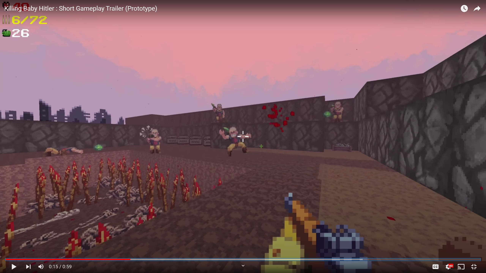

# Chris Pugh's Homepage

<!--
**VirtuosoChris/VirtuosoChris** is a ✨ _special_ ✨ repository because its `README.md` (this file) appears on your GitHub profile.

Here are some ideas to get you started:

- 🔭 I’m currently working on ...
- 🌱 I’m currently learning ...
- 👯 I’m looking to collaborate on ...
- 🤔 I’m looking for help with ...
- 💬 Ask me about ...
- 📫 How to reach me: ...
- 😄 Pronouns: ...
- ⚡ Fun fact: ...
-->

I am an independent game programmer. 

  
  
  

## Current Projects

### Killing Baby Hitler

I am currently making "Killing Baby Hitler", a retro FPS "boomer shooter" inspired by classics like Wolfenstein.  The game is built on a custom engine ("Virtuoso Engine", discussed below).
A gameplay trailer can be seen here: 

The game and engine code will eventually be publicly released under an MIT License, but not yet.  If you are considering me for employment and want an up to date code sample or playable build feel free to contact me and ask.

### Virtuoso Engine
Virtuoso Engine is my personal game and app development framework that I've been working on for about a decade or so in various iterations, and have shipped multiple apps on.  The latest version is being used in the development of "Killing Baby Hitler."

The philosophy of the engine is to be a lightweight framework style engine, sort of like RayLib, but more focusing on C++20, 3D, and physics rather than C99/2D.  I did this because it's the language / paradigm under which I'm most productive as a very experienced C++ programmer with lots of graphics programming and graphics driver experience.

I also am a really strong booster of the ["STB"](https://github.com/nothings/stb) style of library - of making components or functionality that can be forked off without dependencies into a single header permissive license "library."

Several components of the engine can be seen publicly on my GitHub.
[Quake Style Console](https://github.com/VirtuosoChris/VirtuosoConsole) - Debug console and IMGUI widget
[YarnMachine](https://github.com/VirtuosoChris/YarnMachine) - A standalone C++ virtual machine for [YarnSpinner](https://www.yarnspinner.dev/), a narrative scripting language I use in KBH

The engine also puts together and builds on lots of third party open source technologies, including but not limited to:
[PhysX](https://github.com/NVIDIA-Omniverse/PhysX/) - General purpose physics, collision, math, and simulation library
[Eigen](https://eigen.tuxfamily.org/index.php?title=Main_Page) - For matrix and linear algebra
[Dear ImGUI](https://github.com/ocornut/imgui) - For user interfaces and tools prototyping.  Also several other 3rd party repo's for adding gizmos, markdown, and file dialogs to IMGUI.
[MiniAudio](https://miniaud.io/) - For 3D sound playback and music streaming
[Yarn Spinner](https://github.com/YarnSpinnerTool/YarnSpinner) - For dialogue and narrative scripting.  I use their VSCode plugin and their compiler, but built my own C++ runtime discussed above.
[Debug Draw](https://github.com/glampert/debug-draw) - For wireframe primitive visualization
[GLFW](https://github.com/glfw/glfw) and [GLFWPP](https://github.com/Steve132/glfwpp) - for cross platform windowing system and input
[STB](https://github.com/nothings/stb) - Image loading and other miscellanea
[nlohmann's JSON](https://github.com/nlohmann/json) - For data serialization
[MiniZ](https://github.com/richgel999/miniz/) - for compression and bundling of map data

